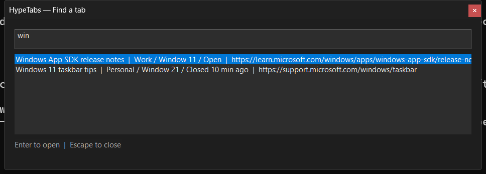
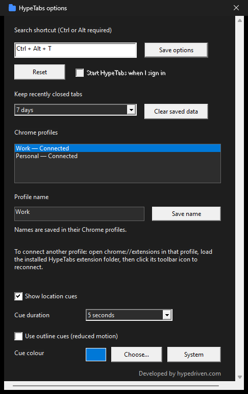
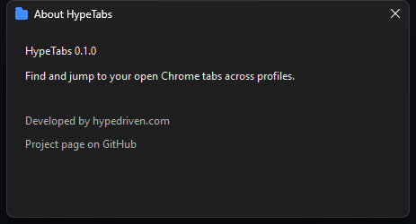
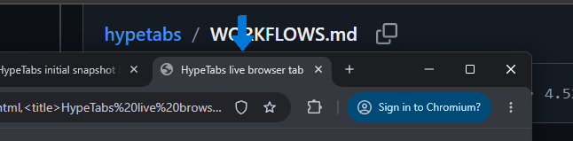
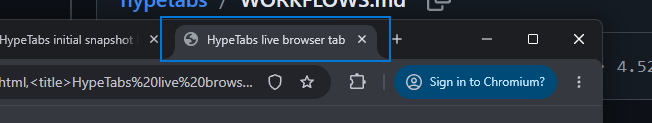

# HypeTabs

A small native Windows tray application for finding Chrome tabs across profiles from a floating search widget. C++ host and native bridge; provisional TypeScript extension. No third-party runtime dependencies. The optional WASM experiment uses an approved external compiler.

## Screenshots

| Search overlay | Options | About |
| --- | --- | --- |
|  |  |  |

Captured from an isolated host fed with synthetic profiles by `tools\screenshots.ps1`; the tray icon changes color with state (grey disconnected, blue connected, amber paused, green while a tab is being activated).

### How guidance works

Pick a result and press Enter. If the tab's Chrome window is not in front, HypeTabs does not steal focus: it selects the tab in the background and points at that window's taskbar button. When you click the button, the cue disappears and a second cue points at the tab header in the window that just came forward. Any other click or Escape dismisses a cue; direct activation is used whenever a position cannot be verified. The cue colour can be changed in Options.

| 1. Arrow at the taskbar button of the window that holds the tab | 2. Arrow under the tab header after the window comes forward |
| --- | --- |
|  |  |

With Windows animation effects off, or the "Use outline cues (reduced motion)" option, the same two stages draw a static outline instead:

| Outline at the taskbar button | Outline at the tab header |
| --- | --- |
|  |  |

These four images come from the live harness (`tools\probe-extension-cft.ps1 -Native -WindowBounds -TaskbarFlow -CaptureDir <folder>`), which records the screen at both cue stages of a real Chrome for Testing window.

This is a development build. Live Chrome for Testing checks now cover the production native bridge, duplicate-title search across two profiles, activation, and same-profile closed-tab reopening. Ordinary Chrome setup, visible-window guidance, remaining options, reliability/performance acceptance, and the WASM comparison are unfinished. See [SPEC.md](SPEC.md), [OUTSTANDING.md](OUTSTANDING.md), and [implementation evidence](docs/IMPLEMENTATION.md).

## Build and test

On Windows with Visual Studio 18 Build Tools and its C++ workload:

```bat
tools\build.cmd
```

With Node 24, from the project directory:

```sh
node tools/build-extension.mjs
node tests/extension.test.mjs
```

Build `tools\build-accessibility-probe.cmd`, then run `tools\smoke.cmd` from Windows to test an isolated temporary copy of the host with two synthetic profile clients; the smoke run uses the probe to read the overlay's UI Automation names from another process. Close any existing HypeTabs instance first. The check closes and removes its own temporary application copy.

Run `tools\benchmark-search.cmd` to compare native search with its previous scorer at idle/background priority. It checks result equivalence and reports elapsed time and CPU cycles for 2,000 synthetic tab records. This does not measure the full UI or Chrome extension.

Run `tools\benchmark-index.cmd` to compare incremental index updates with rebuilding every record. It checks identical final tab metadata and search tokens after mixed duplicate, activity/window, and navigation events, and reports elapsed time and CPU cycles.

Run `tools\measure-host.ps1` in Windows PowerShell for a five-minute loaded-host idle measurement. It uses isolated application data and five synthetic profile connections, checks 2,000 records, measures window-message latency, and writes `build\host-measurement.json`. It briefly opens/closes the search overlay, then leaves it hidden during the idle interval. Close existing HypeTabs processes first. Chrome, physical hotkey delivery, and rendering completion are outside this measurement.

Use `-LatencyOnly` to skip idle sampling and write `build\host-latency.json`, and `-VariedQueries` to alternate between 400, 200, and zero results. `-Executable` selects a saved build for comparison. Latency-only reports leave idle CPU/duration values unset.

For the optional WASM experiment, set `HYPETABS_WASI_CXX` to the approved WASI SDK 27 `clang++` executable, then run `node tools/build-wasm-experiment.mjs` and `node tools/benchmark-wasm-url.mjs`. The local default compiler path and pinned download are recorded in `docs/DEPENDENCIES.md`. The experiment is excluded from normal extension packaging and does not link SDK runtime libraries.

With the existing Chrome for Testing installation, run `powershell -NoProfile -ExecutionPolicy Bypass -File tools\probe-extension-cft.ps1 -WasmBenchmark` on Windows to compare the same kernel inside a disposable extension worker. The report is saved to `build/wasm-chrome-benchmark.json`. This mode does not require native-host registration.

For the isolated visible guidance test, build `tools\build-guidance-probe.cmd`, then run `powershell -NoProfile -ExecutionPolicy Bypass -File tools\probe-extension-cft.ps1 -Native -WindowBounds -TaskbarFlow`. This requires a 96-DPI primary monitor and an unambiguous taskbar target. It clicks the verified test target and test page, checks both cue stages, and restores pointer position and focus. Add `-WindowState minimized|maximized` for those window states, `-TabLayout pinned|grouped|collapsed` for tab-strip variants, `-ExtraWindow` to verify that a second same-profile window suppresses the taskbar cue and direct activation still brings Chrome forward, or (without `-TaskbarFlow`) `-Monitor secondary` to verify direct activation on a secondary monitor; on a scaled monitor the run expects no cue. `-ReducedMotion` (with `-TaskbarFlow`) starts the host with the outline preference and requires outline cues. `-Incognito` (with `-Native`) verifies that a page in a separate off-the-record browser context never reaches native search.

For the live extension-worker probe, run `tools\prepare-chrome-test.ps1`, then `tools\probe-extension-cft.ps1` in Windows PowerShell. Preparation downloads a pinned Google Chrome for Testing archive into Windows temporary storage and configures its sandbox-directory permissions. This first-party test binary is unsigned; the archive digest pins the HTTPS download, not a publisher signature. The probe uses a disposable visible profile (Chrome for Testing 153 exits in headless mode when the worker queries `chrome.system.display`) and loopback DevTools, and verifies the built worker's Chrome API access. It does not yet verify native messaging or restoration. The browser cache is outside release assets and remains for subsequent tests.

Add `-Native` to `tools\probe-extension-cft.ps1` to test the production host and bridge with two disposable browser profiles, duplicate titles, search activation, and closed-tab reopening against a temporary loopback webpage. This mode refuses existing HypeTabs processes or registration, creates exact-origin test registration, and removes it on exit. It displays the native search overlay and both test browsers; without `-TaskbarFlow` it does not prove physical foreground activation or arrows. The extension requests `tabs`, `nativeMessaging`, `storage`, `alarms`, `sessions`, and `system.display` (display layout for cue placement on scaled monitors).

Add `-WindowBounds` alongside `-Native` to make the first browser visible and verify a native tab cue after matching window bounds. This test currently requires 100% scaling on all monitors and unambiguous window geometry. It also verifies a tab loaded before host startup appears in the initial snapshot.

## Development installation

Setup checks source artifacts and destination paths before copying. It refuses redirected or malformed installation paths and preserves unrelated files. Run `tools\test-install.cmd` to exercise these checks using temporary synthetic files; it does not register the browser extension.

1. Build the native application and extension.
2. Run `powershell -NoProfile -File tools\install.ps1`. It copies only application artifacts into `%LOCALAPPDATA%\HypeTabs\App`.
3. In Chrome, open `chrome://extensions`, enable Developer mode, and choose **Load unpacked**. Select `%LOCALAPPDATA%\HypeTabs\App\extension`. Copy the extension ID displayed there.
4. Run `powershell -NoProfile -File tools\install.ps1 -ExtensionId YOUR_EXTENSION_ID` to register the bridge for that extension only.
5. Start `%LOCALAPPDATA%\HypeTabs\App\HypeTabs.exe`, then click the extension's toolbar action to reconnect. Repeat loading the same extension directory for each participating Chrome profile.
6. Press **Win+W**, or use the tray menu's Search command. Change the shortcut in Options if it conflicts with another application; a shortcut needs Ctrl, Alt, or the Windows key. Windows-key combinations the shell reserves (Win+W normally opens Widgets) are intercepted with a keyboard hook.

Profile names default to a short identifier and can be changed in the tray menu’s Options window. Options also offers opt-in start at sign-in and a persistent outline-cue preference for reduced motion. `HypeTabs.exe` is self-contained: on start it unpacks its bridge and extension into `%LOCALAPPDATA%\HypeTabs\App` and registers the native messaging host for that extension folder, so no install script is needed. At startup (and from the tray menu's "Set up Chrome profiles") HypeTabs shows an always-on-top setup window listing any Chrome profile that has not loaded the extension yet, with the steps, a button that opens that profile's window, and the extension folder path ready to paste into Load unpacked; the list updates itself as profiles are done. The startup check can be turned off in Options. Disconnected profiles require opening that profile and reconnecting the extension. The extension does not collect incognito tabs or page contents, and search stays local. The baseline implementation remains subject to the outstanding WASM comparison; it is not a measured language winner.

To remove this development installation, exit HypeTabs and remove its extension from every Chrome profile. Then run:

```powershell
powershell -NoProfile -File "$env:LOCALAPPDATA\HypeTabs\App\uninstall.ps1"
```

The installer includes this script. For an older development installation, run `tools\uninstall.ps1` from this repository instead. Removal deletes known application files, saved settings, and retained closed tabs; `-KeepData` preserves settings and retained tabs. Use `-WhatIf` to preview without changes. Only matching startup/native-host registrations are removed, and unknown files and unrelated registry values are preserved. Redirected directories are rejected. The script requires the app and bridge to be stopped; removing the Chrome extension first prevents reconnection. Isolated removal tests run with `tools\test-uninstall.cmd`; clean-account installation/removal acceptance remains outstanding.

## License

[PolyForm Noncommercial 1.0.0](LICENSE.md). Required Notice: Copyright Hype Driven Development, Inc. (http://hypedriven.com)
